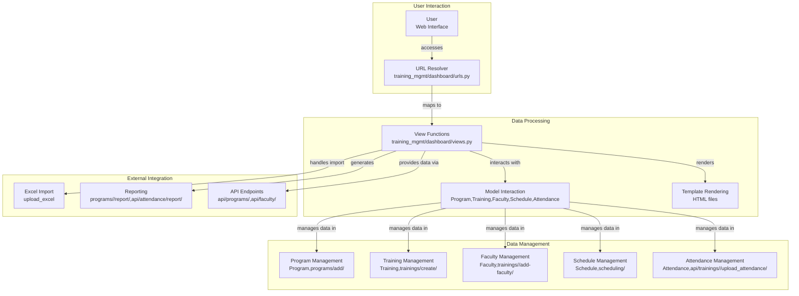

# Codebase Research Report

## Query
show me the overall workflow of the opened Django project

## Answer
### System Diagram

### Summary
# CodeViz Training Management Project Workflow

## Overview

This report outlines the high-level workflow of the Training Management project, a Django-based application. The project facilitates the management of training programs, schedules, faculty, and attendance.

## Key Components

-   **Models:**
    -   `Program` (file:training_mgmt/dashboard/models.py:96): Represents a training program.
    -   `Training` (file:training_mgmt/dashboard/models.py:163): Represents a specific training instance within a program.
    -   `Faculty` (file:training_mgmt/dashboard/models.py:233): Represents a faculty member.
    -   `Schedule` (file:training_mgmt/dashboard/models.py:291): Represents the schedule of a training.
    -   `Employee` (file:training_mgmt/dashboard/models.py:317): Represents an employee.
    -   `Attendance` (file:training_mgmt/dashboard/models.py:418): Represents attendance records for trainings.
-   **Views:** The `training_mgmt/dashboard/views.py` file contains numerous view functions that handle various aspects of the application, including:
    -   Program and training management (add, edit, delete, update).
    -   Faculty management (add, edit, remove).
    -   Schedule management.
    -   Attendance tracking.
    -   Reporting.
    -   Excel import/export.
    -   API endpoints for data access.
-   **URLs:**
    -   Project-level URLs (`training_mgmt/training_mgmt/urls.py`):
        -   `admin/`: Django admin interface.
        -   `api/program_trainings/`: API endpoint for program trainings.
        -   Includes `dashboard.urls`.
        -   `accounts/`: Authentication URLs (login, logout, etc.).
    -   Dashboard-level URLs (`training_mgmt/dashboard/urls.py`): Define URLs for all the dashboard functionalities, mapping them to specific view functions.

## Workflow

1.  **User Access:** Users access the application through various URLs defined in `training_mgmt/dashboard/urls.py`. The base URL (`''`) maps to the `home` view (file:training_mgmt/dashboard/urls.py:8), which likely serves as the main dashboard page. User authentication is handled via the `accounts/` urls included in the project's `urls.py` (file:training_mgmt/training_mgmt/urls.py:27).
2.  **Data Management:**
    -   **Programs and Trainings:** Administrators can manage training programs and individual training instances through dedicated views and URLs, such as `programs/add/` (file:training_mgmt/dashboard/urls.py:28), `trainings/create/` (file:training_mgmt/dashboard/urls.py:31), `programs/<int:program_id>/` (file:training_mgmt/dashboard/urls.py:17), and `trainings/<int:training_id>/` (file:training_mgmt/dashboard/urls.py:19). These views interact with the `Program` and `Training` models to create, retrieve, update, and delete program and training data.
    -   **Faculty:** Faculty members can be added, edited, or removed using views like `trainings/<int:training_id>/add-faculty/` (file:training_mgmt/dashboard/urls.py:21) and `faculty/<int:faculty_id>/remove/` (file:training_mgmt/dashboard/urls.py:22), which interact with the `Faculty` model.
    -   **Schedules:** Training schedules are managed through views associated with URLs like `scheduling/` (file:training_mgmt/dashboard/urls.py:34) and `api/schedules/` (file:training_mgmt/dashboard/urls.py:35), interacting with the `Schedule` model.
    -   **Attendance:** Attendance records are managed through views and URLs such as `api/trainings/<path:training_ids>/upload_attendance/` (file:training_mgmt/dashboard/urls.py:69) and `api/trainings/<path:training_ids>/attendance/list/` (file:training_mgmt/dashboard/urls.py:75), which interact with the `Attendance` model.
3.  **Data Import/Export:** The application supports importing training data from Excel files using the `upload_excel` view (file:training_mgmt/dashboard/urls.py:10) and related functionalities.
4.  **Reporting:** Reports can be generated for programs and trainings through views like `programs/<int:program_id>/report/` (file:training_mgmt/dashboard/urls.py:18) and `api/attendance/report/` (file:training_mgmt/dashboard/urls.py:76).
5.  **API Endpoints:** The application exposes several API endpoints (URLs starting with `api/`) for accessing and manipulating data, enabling integration with other systems. For example, `api/programs/` (file:training_mgmt/dashboard/urls.py:38) provides access to program data, and `api/faculty/` (file:training_mgmt/dashboard/urls.py:39) provides access to faculty data.

## Data Flow

1.  A user interacts with the application through the web interface, triggering requests to specific URLs.
2.  The Django URL resolver maps the URL to a corresponding view function in `training_mgmt/dashboard/views.py`.
3.  The view function processes the request, interacting with the models (e.g., `Program`, `Training`, `Faculty`, `Schedule`, `Attendance`) to retrieve or modify data.
4.  The view function renders a template (HTML file) with the retrieved data, generating the response that is sent back to the user's browser.
5.  API endpoints provide data in a structured format (e.g., JSON) for external applications.

## Additional Notes

-   The `training_mgmt/dashboard/management/commands` directory suggests the presence of custom Django management commands for tasks such as data loading or database maintenance.
-   The presence of `migrations` directory indicates that the database schema is managed using Django's migration framework.
-   The `static` directory contains static files (CSS, JavaScript, images) used by the application's user interface.

## Walkthrough Steps

### 1. Training Management Project Overview
The Training Management project is a Django-based application designed to manage training programs, schedules, faculty, and attendance. The core workflow involves users accessing the application, managing data related to programs, faculty, schedules, and attendance, importing/exporting data, generating reports, and utilizing API endpoints for external integration. Key models include `Program`, `Training`, `Faculty`, `Schedule`, `Employee`, and `Attendance`. The `training_mgmt/dashboard/views.py` file contains view functions for handling various aspects of the application.

### 2. User Access and Data Management
Users interact with the application through URLs defined in `training_mgmt/dashboard/urls.py`. The base URL maps to the `home` view, serving as the main dashboard page. User authentication is handled via the `accounts/` urls. Administrators manage training programs and instances through views and URLs like `programs/add/` and `trainings/create/`, interacting with the `Program` and `Training` models. Faculty management occurs through views like `trainings/<int:training_id>/add-faculty/`, interacting with the `Faculty` model. Schedules are managed through views associated with URLs like `scheduling/`, interacting with the `Schedule` model. Attendance records are managed through views and URLs such as `api/trainings/<path:training_ids>/upload_attendance/`, interacting with the `Attendance` model.

### 3. Data Import/Export, Reporting, and API Endpoints
The application supports importing training data from Excel files using the `upload_excel` view. Reports can be generated for programs and trainings through views like `programs/<int:program_id>/report/` and `api/attendance/report/`. The application exposes API endpoints (URLs starting with `api/`) for accessing and manipulating data, such as `api/programs/` and `api/faculty/`.

### 4. Data Flow Through the Application
A user interacts with the application, triggering requests to specific URLs. The Django URL resolver maps the URL to a corresponding view function in `training_mgmt/dashboard/views.py`. The view function processes the request, interacting with the models (e.g., `Program`, `Training`, `Faculty`, `Schedule`, `Attendance`) to retrieve or modify data. The view function renders a template (HTML file) with the retrieved data, generating the response that is sent back to the user's browser. API endpoints provide data in a structured format (e.g., JSON) for external applications.

## Detailed Sub-Search Results

### 1. What are the URL patterns defined in training_mgmt/training_mgmt/urls.py?
The URL patterns defined in `training_mgmt/training_mgmt/urls.py` are:

-   `admin/`:  This path is handled by `admin.site.urls` (file:training_mgmt/training_mgmt/urls.py:24), which provides the Django admin interface.
-   `api/program_trainings/`: This path is mapped to the `api_program_trainings` view (file:training_mgmt/training_mgmt/urls.py:25) in `dashboard.views` and named `api_program_trainings`.
-   `''`: This path includes the URL patterns defined in `dashboard.urls` (file:training_mgmt/training_mgmt/urls.py:26).
-   `accounts/`: This path includes the default Django authentication URLs (login, logout, password management) from `django.contrib.auth.urls` (file:training_mgmt/training_mgmt/urls.py:27).
-   Additionally, there's a static URL configuration (file:training_mgmt/training_mgmt/urls.py:28) for serving media files during development, mapping `settings.MEDIA_URL` to `settings.MEDIA_ROOT`.

### 2. What are the view functions defined in training_mgmt/dashboard/views.py?
Here's a list of the view functions defined in `training_mgmt/dashboard/views.py`:

*   `parse_time` (file:training_mgmt/dashboard/views.py:52)
*   `parse_date` (file:training_mgmt/dashboard/views.py:62)
*   `home` (file:training_mgmt/dashboard/views.py:71)
*   `register` (file:training_mgmt/dashboard/views.py:146)
*   `import_training_from_excel` (file:training_mgmt/dashboard/views.py:157)
*   `is_staff_or_admin` (file:training_mgmt/dashboard/views.py:318)
*   `validate_excel_file` (file:training_mgmt/dashboard/views.py:324)
*   `upload_excel` (file:training_mgmt/dashboard/views.py:339)
*   `sync_onedrive` (file:training_mgmt/dashboard/views.py:376)
*   `uploaded_files` (file:training_mgmt/dashboard/views.py:407)
*   `delete_uploaded_file` (file:training_mgmt/dashboard/views.py:442)
*   `edit_excel` (file:training_mgmt/dashboard/views.py:470)
*   `dashboard_data` (file:training_mgmt/dashboard/views.py:608)
*   `calendar_programs` (file:training_mgmt/dashboard/views.py:649)
*   `non_calendar_programs` (file:training_mgmt/dashboard/views.py:658)
*   `program_details` (file:training_mgmt/dashboard/views.py:667)
*   `training_details` (file:training_mgmt/dashboard/views.py:678)
*   `edit_faculty` (file:training_mgmt/dashboard/views.py:691)
*   `add_faculty` (file:training_mgmt/dashboard/views.py:722)
*   `remove_faculty` (file:training_mgmt/dashboard/views.py:762)
*   `update_training` (file:training_mgmt/dashboard/views.py:795)
*   `generate_report` (file:training_mgmt/dashboard/views.py:851)
*   `edit_training` (file:training_mgmt/dashboard/views.py:861)
*   `delete_training` (file:training_mgmt/dashboard/views.py:877)
*   `update_training_content` (file:training_mgmt/dashboard/views.py:888)
*   `update_training_benefits` (file:training_mgmt/dashboard/views.py:901)
*   `add_program` (file:training_mgmt/dashboard/views.py:915)
*   `all_programs` (file:training_mgmt/dashboard/views.py:1022)
*   `delete_program` (file:training_mgmt/dashboard/views.py:1031)
*   `create_training` (file:training_mgmt/dashboard/views.py:1041)
*   `update_program` (file:training_mgmt/dashboard/views.py:1067)
*   `calendar_view` (file:training_mgmt/dashboard/views.py:1085)
*   `schedule_trainings` (file:training_mgmt/dashboard/views.py:1091)
*   `api_halls` (file:training_mgmt/dashboard/views.py:1261)
*   `api_programs` (file:training_mgmt/dashboard/views.py:1284)
*   `api_faculty` (file:training_mgmt/dashboard/views.py:1382)
*   `validate_faculty_data` (file:training_mgmt/dashboard/views.py:1510)
*   `api_verify_sync` (file:training_mgmt/dashboard/views.py:1528)
*   `rate_limit` (file:training_mgmt/dashboard/views.py:1599)
*   `api_schedules` (file:training_mgmt/dashboard/views.py:1633)
*   `validate_schedule_data` (file:training_mgmt/dashboard/views.py:1795)
*   `api_trainings` (file:training_mgmt/dashboard/views.py:1819)
*   `api_schedules_batch` (file:training_mgmt/dashboard/views.py:1923)
*   `schedule_program_view` (file:training_mgmt/dashboard/views.py:2168)
*   `api_program_dates_create` (file:training_mgmt/dashboard/views.py:2204)
*   `api_program_dates_update` (file:training_mgmt/dashboard/views.py:2227)
*   `api_program_dates_delete` (file:training_mgmt/dashboard/views.py:2242)
*   `api_schedule_detail` (file:training_mgmt/dashboard/views.py:2252)
*   `backup_restore_view` (file:training_mgmt/dashboard/views.py:2467)
*   `create_backup` (file:training_mgmt/dashboard/views.py:2494)
*   `restore_backup` (file:training_mgmt/dashboard/views.py:2506)
*   `delete_backup` (file:training_mgmt/dashboard/views.py:2522)
*   `get_csrf_token` (file:training_mgmt/dashboard/views.py:2542)
*   `mor_upload` (file:training_mgmt/dashboard/views.py:2546)
*   `mor_list` (file:training_mgmt/dashboard/views.py:2570)
*   `update_program_type` (file:training_mgmt/dashboard/views.py:2581)
*   `api_program_upload_document` (file:training_mgmt/dashboard/views.py:2601)
*   `api_program_delete_document` (file:training_mgmt/dashboard/views.py:2628)
*   `api_program_list_documents` (file:training_mgmt/dashboard/views.py:2646)
*   `api_program_delete_document` (file:training_mgmt/dashboard/views.py:2665)
*   `import_programs` (file:training_mgmt/dashboard/views.py:2699)
*   `schedule_program` (file:training_mgmt/dashboard/views.py:2761)
*   `upload_program_document` (file:training_mgmt/dashboard/views.py:2786)
*   `analyze_attendance` (file:training_mgmt/dashboard/views.py:2803)
*   `api_training_upload_attendance` (file:training_mgmt/dashboard/views.py:2891)
*   `api_training_view_attendance` (file:training_mgmt/dashboard/views.py:2936)
*   `api_training_download_attendance` (file:training_mgmt/dashboard/views.py:2955)
*   `api_training_delete_attendance` (file:training_mgmt/dashboard/views.py:2997)
*   `api_training_attendance_status` (file:training_mgmt/dashboard/views.py:3033)
*   `api_training_attendance_list` (file:training_mgmt/dashboard/views.py:3114)
*   `api_faculty_detail` (file:training_mgmt/dashboard/views.py:3133)
*   `update_training_type` (file:training_mgmt/dashboard/views.py:3152)
*   `get_training_schedule` (file:training_mgmt/dashboard/views.py:3191)
*   `api_update_training_type` (file:training_mgmt/dashboard/views.py:3256)
*   `api_schedule_upload_document` (file:training_mgmt/dashboard/views.py:3290)
*   `api_schedule_update_type` (file:training_mgmt/dashboard/views.py:3329)
*   `api_program_trainings` (file:training_mgmt/dashboard/views.py:3361)
*   `scheduling` (file:training_mgmt/dashboard/views.py:3372)
*   `generate_attendance_report` (file:training_mgmt/dashboard/views.py:3383)

I have listed all the function definitions found in the file.

### 3. What are the URL patterns defined in training_mgmt/dashboard/urls.py?
Here are the URL patterns defined in `training_mgmt/dashboard/urls.py`:

-   `''`: maps to `views.home`, name='dashboard-home' (file:training_mgmt/dashboard/urls.py:8)
-   `'accounts/register/'`: maps to `views.register`, name='register' (file:training_mgmt/dashboard/urls.py:9)
-   `'upload/'`: maps to `views.upload_excel`, name='upload_excel' (file:training_mgmt/dashboard/urls.py:10)
-   `'sync-onedrive/'`: maps to `views.sync_onedrive`, name='sync-onedrive' (file:training_mgmt/dashboard/urls.py:11)
-   `'uploaded-files/'`: maps to `views.uploaded_files`, name='uploaded-files' (file:training_mgmt/dashboard/urls.py:12)
-   `'delete-file/<str:filename>/'`: maps to `views.delete_uploaded_file`, name='delete-uploaded-file' (file:training_mgmt/dashboard/urls.py:13)
-   `'edit-file/<str:filename>/'`: maps to `views.edit_excel`, name='edit-excel' (file:training_mgmt/dashboard/urls.py:14)
-   `'programs/calendar/'`: maps to `views.calendar_programs`, name='calendar_programs' (file:training_mgmt/dashboard/urls.py:15)
-   `'programs/non-calendar/'`: maps to `views.non_calendar_programs`, name='non_calendar_programs' (file:training_mgmt/dashboard/urls.py:16)
-   `'programs/<int:program_id>/'`: maps to `views.program_details`, name='program_details' (file:training_mgmt/dashboard/urls.py:17)
-   `'programs/<int:program_id>/report/'`: maps to `views.generate_report`, name='generate_report' (file:training_mgmt/dashboard/urls.py:18)
-   `'trainings/<int:training_id>/'`: maps to `views.training_details`, name='training_details' (file:training_mgmt/dashboard/urls.py:19)
-   `'trainings/<int:training_id>/update/'`: maps to `views.update_training`, name='update_training' (file:training_mgmt/dashboard/urls.py:20)
-   `'trainings/<int:training_id>/add-faculty/'`: maps to `views.add_faculty`, name='add_faculty' (file:training_mgmt/dashboard/urls.py:21)
-   `'faculty/<int:faculty_id>/remove/'`: maps to `views.remove_faculty`, name='remove_faculty' (file:training_mgmt/dashboard/urls.py:22)
-   `'training/<int:training_id>/edit/'`: maps to `views.edit_training`, name='edit_training' (file:training_mgmt/dashboard/urls.py:23)
-   `'training/<int:training_id>/delete/'`: maps to `views.delete_training`, name='delete_training' (file:training_mgmt/dashboard/urls.py:24)
-   `'training/<int:training_id>/content/'`: maps to `views.update_training_content`, name='update_training_content' (file:training_mgmt/dashboard/urls.py:25)
-   `'training/<int:training_id>/benefits/'`: maps to `views.update_training_benefits`, name='update_training_benefits' (file:training_mgmt/dashboard/urls.py:26)
-   `'faculty/<int:faculty_id>/edit/'`: maps to `views.edit_faculty`, name='edit_faculty' (file:training_mgmt/dashboard/urls.py:27)
-   `'programs/add/'`: maps to `views.add_program`, name='add_program' (file:training_mgmt/dashboard/urls.py:28)
-   `'programs/all/'`: maps to `views.all_programs`, name='all_programs' (file:training_mgmt/dashboard/urls.py:29)
-   `'programs/<int:program_id>/delete/'`: maps to `views.delete_program`, name='delete_program' (file:training_mgmt/dashboard/urls.py:30)
-   `'trainings/create/'`: maps to `views.create_training`, name='create_training' (file:training_mgmt/dashboard/urls.py:31)
-   `'programs/<int:program_id>/update/'`: maps to `views.update_program`, name='update_program' (file:training_mgmt/dashboard/urls.py:32)
-   `'calendar/'`: maps to `views.calendar_view`, name='calendar' (file:training_mgmt/dashboard/urls.py:33)
-   `'scheduling/'`: maps to `views.calendar_view`, name='scheduling' (file:training_mgmt/dashboard/urls.py:34)
-   `'api/schedules/'`: maps to `views.api_schedules`, name='api_schedules' (file:training_mgmt/dashboard/urls.py:35)
-   `'api/schedules/batch/'`: maps to `views.api_schedules_batch`, name='api_schedules_batch' (file:training_mgmt/dashboard/urls.py:36)
-   `'api/halls/'`: maps to `views.api_halls`, name='api_halls' (file:training_mgmt/dashboard/urls.py:37)
-   `'api/programs/'`: maps to `views.api_programs`, name='api_programs' (file:training_mgmt/dashboard/urls.py:38)
-   `'api/faculty/'`: maps to `views.api_faculty`, name='api_faculty' (file:training_mgmt/dashboard/urls.py:39)
-   `'api/faculty/<int:faculty_id>/'`: maps to `views.api_faculty_detail`, name='api_faculty_detail' (file:training_mgmt/dashboard/urls.py:40)
-   `'api/trainings/'`: maps to `views.api_trainings`, name='api_trainings' (file:training_mgmt/dashboard/urls.py:41)
-   `'dashboard/schedule_program/<int:program_id>/'`: maps to `views.schedule_program_view`, name='schedule_program' (file:training_mgmt/dashboard/urls.py:42)
-   `'dashboard/update_program_type/<int:program_id>/'`: maps to `views.update_program_type`, name='update_program_type' (file:training_mgmt/dashboard/urls.py:43)
-   `'mor/upload/'`: maps to `views.mor_upload`, name='mor_upload' (file:training_mgmt/dashboard/urls.py:44)
-   `'mor/list/'`: maps to `views.mor_list`, name='mor_list' (file:training_mgmt/dashboard/urls.py:45)
-   `'schedule-trainings/'`: maps to `views.schedule_trainings`, name='schedule_trainings' (file:training_mgmt/dashboard/urls.py:46)
-   `'api/schedules/bulk/'`: maps to `views.api_schedules_batch`, name='api_schedules_batch' (file:training_mgmt/dashboard/urls.py:47)
-   `'api/program-dates/'`: maps to `views.api_program_dates_create`, name='api_program_dates_create' (file:training_mgmt/dashboard/urls.py:48)
-   `'api/program-dates/<int:sched_id>/'`: maps to `views.api_program_dates_update`, name='api_program_dates_update' (file:training_mgmt/dashboard/urls.py:49)
-   `'api/program-dates/<int:sched_id>/'`: maps to `views.api_program_dates_delete`, name='api_program_dates_delete' (file:training_mgmt/dashboard/urls.py:50)
-   `'api/verify-sync/'`: maps to `views.api_verify_sync`, name='api_verify_sync' (file:training_mgmt/dashboard/urls.py:51)
-   `'api/schedules/<int:schedule_id>/'`: maps to `views.api_schedule_detail`, name='api_schedule_detail' (file:training_mgmt/dashboard/urls.py:52)
-   `'backup-restore/'`: maps to `views.backup_restore_view`, name='backup_restore' (file:training_mgmt/dashboard/urls.py:53)
-   `'backup-restore/create/'`: maps to `views.create_backup`, name='create_backup' (file:training_mgmt/dashboard/urls.py:54)
-   `'backup-restore/restore/'`: maps to `views.restore_backup`, name='restore_backup' (file:training_mgmt/dashboard/urls.py:55)
-   `'backup-restore/delete/'`: maps to `views.delete_backup`, name='delete_backup' (file:training_mgmt/dashboard/urls.py:56)
-   `'api/programs/<int:program_id>/update_type/'`: maps to `views.update_program_type`, name='update-program-type' (file:training_mgmt/dashboard/urls.py:57)
-   `'api/programs/<int:program_id>/upload_document/'`: maps to `api_program_upload_document`, name='api_program_upload_document' (file:training_mgmt/dashboard/urls.py:58)
-   `'api/programs/<int:program_id>/list_documents/'`: maps to `views.api_program_list_documents`, name='api_program_list_documents' (file:training_mgmt/dashboard/urls.py:59)
-   `'api/programs/<int:program_id>/delete_document/'`: maps to `views.api_program_delete_document`, name='api_program_delete_document' (file:training_mgmt/dashboard/urls.py:60)
-   `'feedback/form/'`: maps to `views.feedback_form`, name='feedback_form' (file:training_mgmt/dashboard/urls.py:62)
-   `'assessment/pre/'`: maps to `views.pre_assessment`, name='pre_assessment' (file:training_mgmt/dashboard/urls.py:63)
-   `'assessment/post/'`: maps to `views.post_assessment`, name='post_assessment' (file:training_mgmt/dashboard/urls.py:64)
-   `'assessment/manager-checklist/'`: maps to `views.manager_checklist`, name='manager_checklist' (file:training_mgmt/dashboard/urls.py:65)
-   `'assessment/roi/'`: maps to `views.roi_dashboard`, name='roi' (file:training_mgmt/dashboard/urls.py:66)
-   `'programs/<int:program_id>/upload-doc/'`: maps to `upload_program_document`, name='upload_program_document' (file:training_mgmt/dashboard/urls.py:67)
-   `'training/<path:training_ids>/analyze-attendance/'`: maps to `views.analyze_attendance`, name='analyze-attendance' (file:training_mgmt/dashboard/urls.py:68)
-   `'api/trainings/<path:training_ids>/upload_attendance/'`: maps to `views.api_training_upload_attendance`, name='api_training_upload_attendance' (file:training_mgmt/dashboard/urls.py:69)
-   `'api/trainings/<path:training_ids>/view_attendance/'`: maps to `views.api_training_view_attendance`, name='api_training_view_attendance' (file:training_mgmt/dashboard/urls.py:70)
-   `'api/trainings/<path:training_ids>/download_attendance/'`: maps to `views.api_training_download_attendance`, name='api_training_download_attendance' (file:training_mgmt/dashboard/urls.py:71)
-   `'api/trainings/<path:training_ids>/delete_attendance/'`: maps to `views.api_training_delete_attendance`, name='api_training_delete_attendance' (file:training_mgmt/dashboard/urls.py:72)
-   `'api/trainings/<path:training_ids>/attendance/status/'`: maps to `views.api_training_attendance_status`, name='api_training_attendance_status' (file:training_mgmt/dashboard/urls.py:74)
-   `'api/trainings/<path:training_ids>/attendance/list/'`: maps to `views.api_training_attendance_list`, name='api_training_attendance_list' (file:training_mgmt/dashboard/urls.py:75)
-   `'api/attendance/report/'`: maps to `views.generate_attendance_report`, name='generate_attendance_report' (file:training_mgmt/dashboard/urls.py:76)
-   `'dashboard/update_training_type/<int:training_id>/'`: maps to `views.update_training_type`, name='update_training_type' (file:training_mgmt/dashboard/urls.py:77)
-   `'api/schedules/training/<int:training_id>/'`: maps to `views.get_training_schedule`, name='get_training_schedule' (file:training_mgmt/dashboard/urls.py:78)
-   `'api/trainings/<int:training_id>/update-type/'`: maps to `views.api_update_training_type`, name='api_update_training_type' (file:training_mgmt/dashboard/urls.py:79)
-   `'api/schedules/<int:schedule_id>/upload-document/'`: maps to `views.api_schedule_upload_document`, name='api_schedule_upload_document' (file:training_mgmt/dashboard/urls.py:80)
-   `'api/schedules/<int:schedule_id>/update-type/'`: maps to `views.api_schedule_update_type`, name='api_schedule_update_type' (file:training_mgmt/dashboard/urls.py:81)

### 4. What are the models defined in training_mgmt/dashboard/models.py?
The following models are defined in `training_mgmt/dashboard/models.py`:

*   `AuditLog` (file:training_mgmt/dashboard/models.py:63)
*   `Program` (file:training_mgmt/dashboard/models.py:96)
*   `Training` (file:training_mgmt/dashboard/models.py:163)
*   `Faculty` (file:training_mgmt/dashboard/models.py:233)
*   `TrainingAttendance` (file:training_mgmt/dashboard/models.py:262)
*   `TrainingMetrics` (file:training_mgmt/dashboard/models.py:272)
*   `Hall` (file:training_mgmt/dashboard/models.py:284)
*   `Schedule` (file:training_mgmt/dashboard/models.py:291)
*   `Employee` (file:training_mgmt/dashboard/models.py:317)
*   `MORUpload` (file:training_mgmt/dashboard/models.py:357)
*   `ProgramScheduleDate` (file:training_mgmt/dashboard/models.py:378)
*   `Participant` (file:training_mgmt/dashboard/models.py:387)
*   `ProgramDocument` (file:training_mgmt/dashboard/models.py:403)
*   `TrainingAttendanceFile` (file:training_mgmt/dashboard/models.py:410)
*   `Attendance` (file:training_mgmt/dashboard/models.py:418)

---
*Generated by [CodeViz.ai](https://codeviz.ai) on 6/14/2025, 12:05:22 AM*
